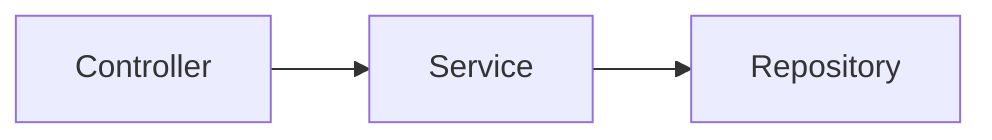

## Backend Configuration

### Setup Docker Container

In order to build and run the backend ensure you have the following installed.
-   [Docker](https://www.docker.com/products/docker-desktop)

The backend requires a MySQL database to be up and running.  The easiest way to accomplish this is to run the following commands.

```bash
docker pull mysql:latest
docker run --name serenitydr-db -e MYSQL_ROOT_PASSWORD=password -e MYSQL_DATABASE=serenitydr -p 3306:3306 -d mysql:latest
```

This will launch a docker container with the default username of 'root', password of 'password', and map port 3306 of your machine to port 3306 of the docker container to establish connections.

### Springboot

If we want to have a dedicated backend that can communicate and authorize requests from our Android application, the Springboot framework is a great option.  It is extensively documented and is compatible with both Java and Kotlin code.  The backend would be lightweight, as it only needs to interface with our Database.  Additional documentation can be found here.

-   [Springboot](https://docs.spring.io/spring-boot/index.html)

The general structure for creating backend services in Springboot is as follows.



Where the **Controller** layer is where we expose our REST API endpoints, the **Service** layer handles any business logic needed when retrieving or saving data.  All database interactions take place in the **Repository**.  This design pattern allows for a simple abstraction, decoupling our database and application centric logic.

Any kind of authorization that is required from a potential REST API could be handled through the Firebase API in Springboot, which provides methods for validating JWT tokens from incoming requests.  The Spring Security libraries allow us to intercept requests, and require certain authentication rules to be valid before acceptign them.

### Firebase

Firebase also has document-based storage options, which would avoid the need to write any backend code or host a Database.

-   [Firebase](https://firebase.google.com/docs/firestore/)
